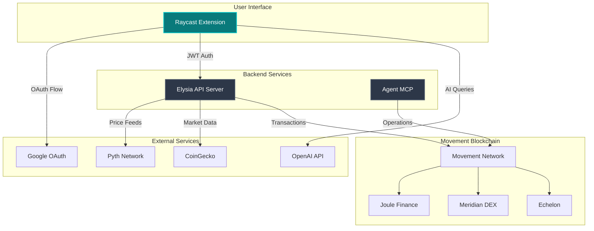
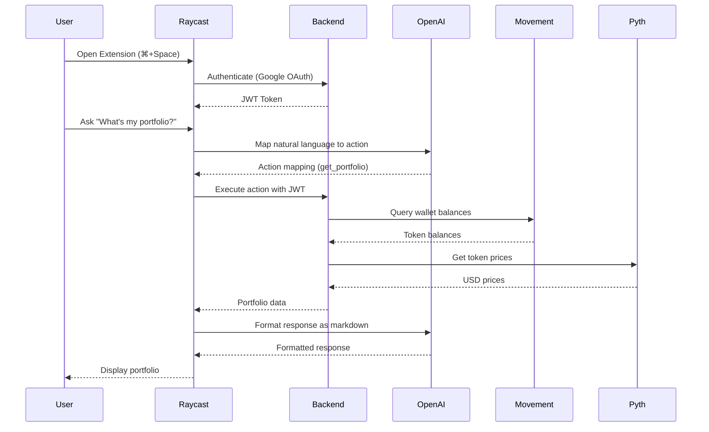
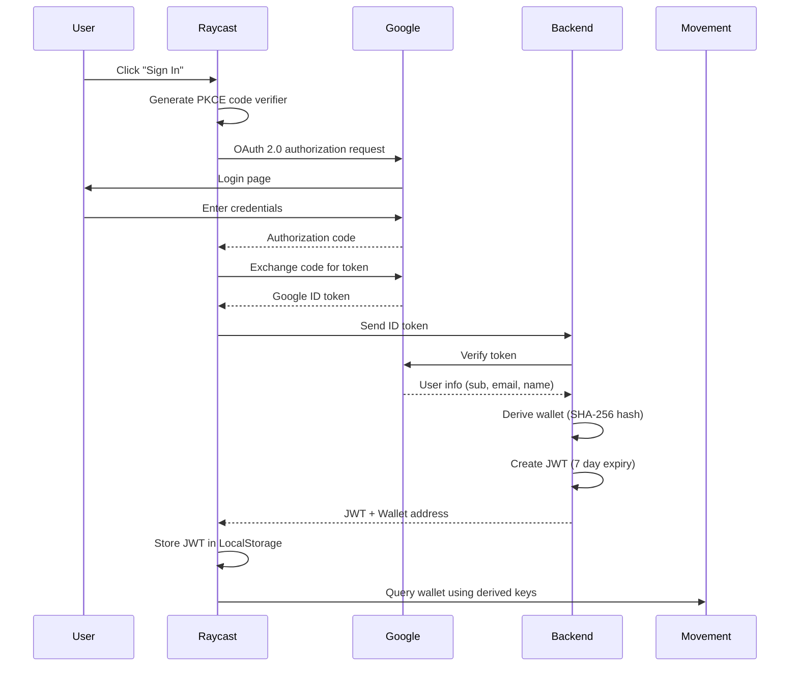
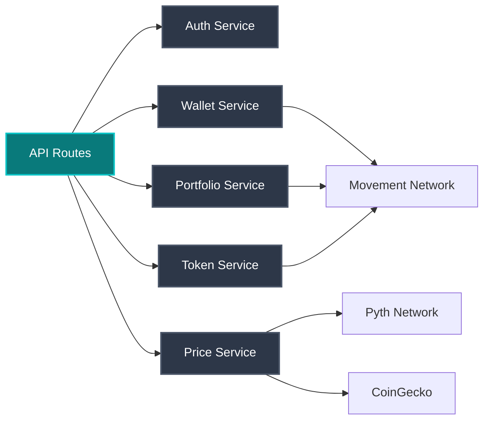
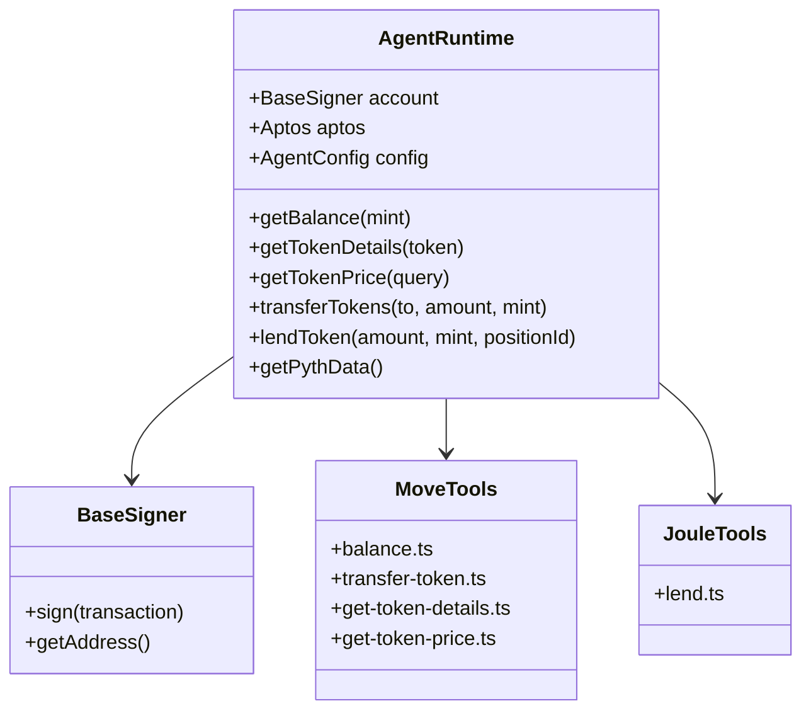
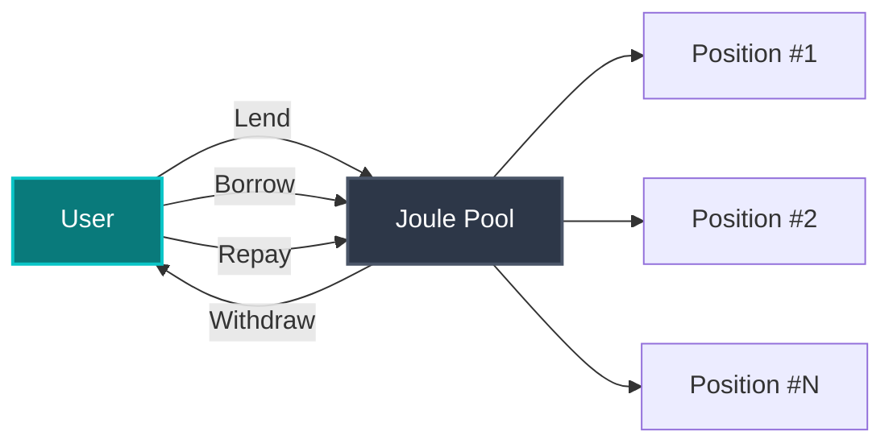
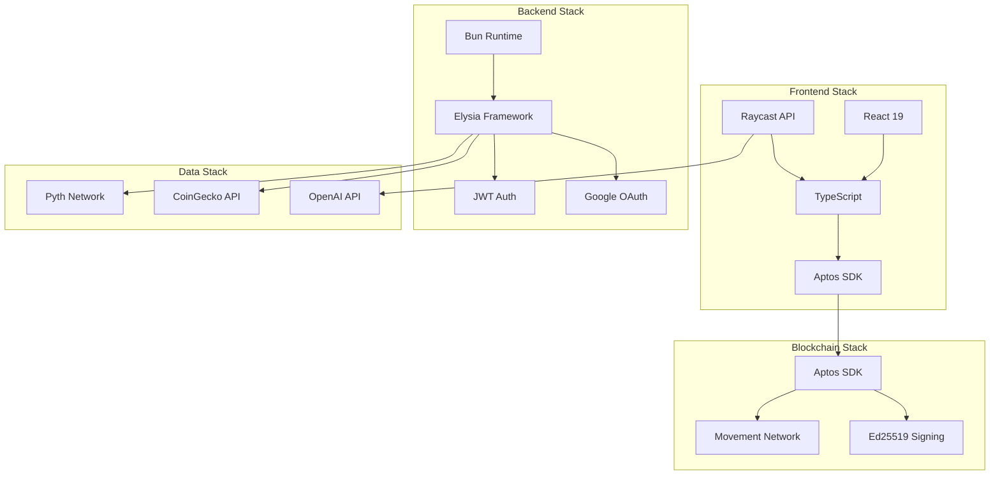

# MoveCast 🚀

> Movement Labs at your command - Everything at your fingertips

[](https://choosealicense.com/licenses/mit/)
[](https://www.raycast.com/)
[](https://movementlabs.xyz/)

MoveCast is a powerful Raycast extension that brings the Movement blockchain ecosystem to your command bar. Execute DeFi operations, manage your portfolio, and interact with Movement protocols in seconds - all without leaving your keyboard.


## 🌟 Features

- **🤖 AI-Powered Chat** - Ask anything about your wallet, portfolio, or tokens using natural language
- **💼 Portfolio Management** - View real-time token balances with USD values powered by Pyth oracles
- **🏦 DeFi Integration** - Access Joule Finance, Meridian DEX, and Echelon protocols directly
- **⚡ Lightning Fast** - Execute trades, lends, and swaps in seconds from your command bar
- **🔐 Secure Authentication** - Google OAuth 2.0 with deterministic wallet derivation
- **📊 Real-time Prices** - Live price feeds from Pyth Network and CoinGecko

## 📋 Table of Contents

- [Architecture](#-architecture)
- [Components](#-components)
- [DeFi Integrations](#-defi-integrations)
- [Installation](#-installation)
- [Usage](#-usage)
- [Development](#-development)
- [Technology Stack](#-technology-stack)
- [Project Structure](#-project-structure)
- [API Reference](#-api-reference)
- [Contributing](#-contributing)
- [License](#-license)

## 🏗️ Architecture

MoveCast is built as a multi-component system with four main parts working together:



### System Flow



### Authentication Flow



## 🧩 Components

### 1. Raycast Extension (`/src`)

The main user interface built with React and Raycast API. Provides 11 commands for blockchain interaction:

**Commands:**
- `index` - Launch MoveCast
- `get-wallet` - View your Movement wallet address
- `get-portfolio` - View complete token portfolio
- `get-token-overview` - Get detailed token information
- `joule-lend` - Lend tokens to Joule Finance
- `joule-borrow` - Borrow from Joule Finance
- `joule-withdraw` - Withdraw from Joule positions
- `joule-repay` - Repay borrowed amounts
- `meridian-swap` - Swap tokens on Meridian DEX
- `echelon-lend` - Supply to Echelon lending pools
- `movecast-ai` - AI-powered natural language interface

**Key Features:**
- TypeScript + React components
- Aptos SDK integration (@aptos-labs/ts-sdk v5.2.0)
- OpenAI GPT-4o-mini for natural language processing
- Form-based UIs for all DeFi operations
- Real-time transaction status updates

### 2. Backend API (`/backend`)

High-performance API server built with Bun and Elysia framework.

**Technology:**
- **Runtime:** Bun (ultra-fast JavaScript runtime)
- **Framework:** Elysia (lightning-fast web framework)
- **SDK:** Aptos TS SDK v1.33.1
- **Auth:** JWT + Google OAuth2

**Key Services:**



**API Endpoints:**
- `POST /api/auth/callback` - Verify Google token, issue JWT
- `GET /api/auth/me` - Get current user information
- `POST /api/execute.action` - Execute actions (wallet, portfolio, tokens)
- `GET /api/prices/:address` - Get real-time token price
- `GET /api/token/:address` - Get token metadata and information

**Wallet Derivation:**
```
Google User ID + SALT → SHA-256 Hash → Ed25519 Private Key → Movement Wallet
```

### 3. Agent MCP (`/agent-mcp`)

Blockchain operations toolkit providing low-level transaction capabilities.

**Tools:**
- `getBalance` - Query token balances
- `getTokenDetails` - Fetch token metadata
- `getTokenPrice` - Get real-time prices from Pyth
- `transferTokens` - Send tokens to addresses
- `lendToken` - Lend to Joule Finance positions

**Architecture:**



### 4. Frontend (`/frontend`)

Next.js landing page with modern glassmorphic design.

**Features:**
- Next.js 16.1.1 with React 19
- Tailwind CSS v4 styling
- Responsive design
- Installation CTA
- Feature showcase
- Usage guide

## 🏦 DeFi Integrations

### Joule Finance

**Contract:** `0x6a164188af7bb6a8268339343a5afe0242292713709af8801dafba3a054dc2f2`



**Operations:**
- **Lend:** Supply tokens to earn interest
  - Function: `pool::lend<AssetType>`
  - Params: amount, position_id, decimals
- **Borrow:** Take loans against collateral
  - Function: `pool::borrow<AssetType>`
  - Params: amount, position_id, decimals
- **Withdraw:** Remove supplied tokens
  - Function: `pool::withdraw<AssetType>`
  - Params: amount, position_id, decimals
- **Repay:** Pay back borrowed amounts
  - Function: `pool::repay<AssetType>`
  - Params: amount, position_id, decimals

### Meridian DEX

**Contract:** `0xc36ceb6d7b137cea4897d4bc82d8e4d8be5f964c4217dbc96b0ba03cc64070f4`


**Features:**
- Multi-hop routing through liquidity pools
- Slippage protection with min_amount_out
- Exact input swaps
- Payload-based routing (copy from Meridian UI)

**Operation:**
- **Swap:** Exchange tokens via optimal route
  - Function: `router::swap_exact_in_router_entry`
  - Params: payload (contains routing info)

### Echelon

**Contract:** `0x6a01d5761d43a5b5a0ccbfc42edf2d02c0611464aae99a2ea0e0d4819f0550b5`

**Pool Addresses:**
- MOVE Pool: `0x568f96c4c3c7c5e00e08fc13d70a25c8b53b6ba38ab9e37fd72d6a2f8d0b4aca`

**Operations:**
- **Supply MOVE:** Supply native MOVE tokens
  - Function: `scripts::supply`
  - Params: pool, amount
- **Supply FA:** Supply fungible assets
  - Function: `scripts::supply_fa`
  - Params: pool, amount

## 📦 Installation

### Prerequisites

- **Raycast:** [Download Raycast](https://www.raycast.com/)
- **Node.js:** v18+
- **Bun:** v1.0+ (for backend)
- **OpenAI API Key:** For AI features (optional)

### Install Extension

1. **Clone the repository:**
```bash
git clone https://github.com/Nishu0/movecast.git
cd movecast
```

2. **Install dependencies:**
```bash
npm install
# or
pnpm install
```

3. **Configure environment:**
```bash
cp .env.example .env
# Edit .env with your API keys
```

4. **Build and install:**
```bash
npm run build
npm run publish
```

### Setup Backend

1. **Navigate to backend:**
```bash
cd backend
```

2. **Install dependencies:**
```bash
bun install
```

3. **Configure environment:**
```bash
# Create .env file
JWT_SECRET=your-secret-key
WALLET_DERIVATION_SALT=your-salt
GOOGLE_CLIENT_ID=your-google-client-id
GOOGLE_CLIENT_SECRET=your-google-client-secret
```

4. **Start server:**
```bash
bun run dev
```

### Setup Frontend (Optional)

1. **Navigate to frontend:**
```bash
cd frontend
```

2. **Install dependencies:**
```bash
npm install
```

3. **Start development server:**
```bash
npm run dev
```

## 🎯 Usage

### Quick Start

1. **Open Raycast:** Press `⌘ + Space`
2. **Launch MoveCast:** Type `MoveCast` and press Enter
3. **Authenticate:** Sign in with Google
4. **Start using:** Execute commands or use AI chat

### AI Chat Interface

```bash
# Open AI chat
⌘ + Space → "Movecast AI"

# Example queries
"What's my portfolio?"
"Show my wallet address"
"What's the price of MOVE?"
"Lend 10 MOVE to Joule"
"Swap 5 MOVE for USDC"
```

### Command Reference

```bash
# Wallet Management
get-wallet              # View wallet address
get-portfolio           # View all token balances

# Token Information
get-token-overview      # Get token details and price

# Joule Finance
joule-lend             # Lend tokens to earn interest
joule-borrow           # Borrow against collateral
joule-withdraw         # Withdraw supplied tokens
joule-repay            # Repay borrowed amounts

# Meridian DEX
meridian-swap          # Swap tokens

# Echelon
echelon-lend           # Supply to lending pools

# AI Assistant
movecast-ai            # Natural language interface
```

## 🛠️ Development

### Project Structure

```
movecast/
├── src/                          # Raycast Extension
│   ├── actions/                  # DeFi protocol actions
│   │   ├── joule/               # Joule Finance operations
│   │   ├── meridian/            # Meridian DEX operations
│   │   └── echelon/             # Echelon operations
│   ├── components/              # React UI components
│   │   ├── joule/               # Joule forms
│   │   ├── meridian/            # Meridian forms
│   │   └── echelon/             # Echelon forms
│   ├── utils/                   # Utility functions
│   │   ├── auth.ts              # OAuth & session management
│   │   ├── aptos.ts             # Aptos client setup
│   │   ├── llm-service.ts       # AI query processing
│   │   └── api-wrapper.ts       # Backend API client
│   ├── hooks/                   # React hooks
│   └── constants/               # Configuration
│
├── backend/                     # Elysia API Server
│   └── src/
│       ├── routes/              # API endpoints
│       │   ├── auth.ts          # Authentication
│       │   ├── execute.ts       # Action execution
│       │   ├── price.ts         # Price feeds
│       │   └── token.ts         # Token info
│       ├── services/            # Business logic
│       │   ├── walletService.ts
│       │   ├── priceService.ts
│       │   └── portfolioService.ts
│       └── lib/                 # External integrations
│           └── pyth.ts
│
├── agent-mcp/                   # Agent MCP Tools
│   ├── tools/                   # Blockchain operations
│   │   ├── move/               # Core Move operations
│   │   └── joule/              # Joule operations
│   ├── signers/                # Transaction signing
│   ├── langchain/              # LangChain integration
│   └── agent.ts                # Agent runtime
│
├── frontend/                    # Next.js Landing Page
│   └── app/
│       ├── layout.tsx
│       └── page.tsx
│
└── assets/                      # Icons and images
```

### Tech Stack Details



### Adding New DeFi Protocols

1. **Create action file:**
```typescript
// src/actions/myprotocol/operation.ts
import { Account, Aptos } from "@aptos-labs/ts-sdk";

export async function myOperation(
  aptos: Aptos,
  account: Account,
  params: MyParams
) {
  const transaction = await aptos.transaction.build.simple({
    sender: account.accountAddress,
    data: {
      function: "0xcontract::module::function",
      typeArguments: [],
      functionArguments: [params.amount],
    },
  });

  const committedTxn = await aptos.signAndSubmitTransaction({
    signer: account,
    transaction,
  });

  return await aptos.waitForTransaction({
    transactionHash: committedTxn.hash,
  });
}
```

2. **Create UI component:**
```typescript
// src/components/myprotocol/MyForm.tsx
import { Form, ActionPanel, Action } from "@raycast/api";
import { useState } from "react";

export function MyProtocolForm() {
  const [amount, setAmount] = useState("");

  async function handleSubmit() {
    // Call your action
  }

  return (
    <Form
      actions={
        <ActionPanel>
          <Action.SubmitForm onSubmit={handleSubmit} />
        </ActionPanel>
      }
    >
      <Form.TextField
        id="amount"
        title="Amount"
        value={amount}
        onChange={setAmount}
      />
    </Form>
  );
}
```

3. **Register command in `package.json`:**
```json
{
  "commands": [
    {
      "name": "myprotocol-operation",
      "title": "My Protocol Operation",
      "subtitle": "MoveCast",
      "description": "Execute operation on My Protocol",
      "mode": "view"
    }
  ]
}
```

### Testing

```bash
# Test Raycast extension
npm run dev

# Test backend
cd backend
bun test

# Lint code
npm run lint

# Fix linting issues
npm run fix-lint
```

## 📚 API Reference

### Backend API

**Base URL:** `http://localhost:8787`

#### Authentication

```typescript
// POST /api/auth/callback
{
  "idToken": "google-id-token"
}

// Response
{
  "token": "jwt-token",
  "user": {
    "id": "user-id",
    "email": "user@example.com",
    "name": "User Name",
    "picture": "https://..."
  },
  "wallet": "0x..."
}
```

#### Execute Action

```typescript
// POST /api/execute.action
// Headers: Authorization: Bearer <jwt-token>
{
  "method": "get_portfolio" | "get_wallet" | "get_token",
  "params": {
    // method-specific parameters
  }
}

// Response
{
  "success": true,
  "data": {
    // method-specific response
  }
}
```

#### Price Data

```typescript
// GET /api/prices/:address
{
  "address": "0x1::aptos_coin::AptosCoin",
  "price": 10.50,
  "change_24h": 2.5,
  "source": "pyth",
  "timestamp": "2024-01-10T12:00:00Z"
}
```

### Agent MCP

```typescript
import { AgentRuntime } from "./agent-mcp";

// Initialize agent
const agent = new AgentRuntime(signer, aptos, {
  network: "mainnet",
  fullnode: "https://mainnet.movementnetwork.xyz/v1"
});

// Get balance
const balance = await agent.getBalance("0x1::aptos_coin::AptosCoin");

// Transfer tokens
await agent.transferTokens(
  "0xrecipient",
  100,
  "0x1::aptos_coin::AptosCoin"
);

// Lend to Joule
await agent.lendToken(
  100,
  "0x1::aptos_coin::AptosCoin",
  "position-id",
  false,
  false
);
```

## 🔑 Environment Variables

### Backend `.env`

```bash
# Server
PORT=8787

# JWT
JWT_SECRET=your-jwt-secret-key

# Wallet Derivation
WALLET_DERIVATION_SALT=your-random-salt

# Google OAuth
GOOGLE_CLIENT_ID=your-google-client-id.apps.googleusercontent.com
GOOGLE_CLIENT_SECRET=your-google-client-secret

# Movement Network
MOVEMENT_RPC_URL=https://mainnet.movementnetwork.xyz/v1

# CoinGecko (Optional)
COINGECKO_API_KEY=your-coingecko-api-key
```

### Raycast Extension

Configure in Raycast extension preferences or `config.ts`:

```typescript
// src/config.ts
export const config = {
  OPENAI_API_KEY: process.env.OPENAI_API_KEY || "",
  BACKEND_URL: process.env.BACKEND_URL || "http://localhost:8787",
};
```

## 🤝 Contributing

Contributions are welcome! Please follow these steps:

1. Fork the repository
2. Create a feature branch (`git checkout -b feature/amazing-feature`)
3. Commit your changes (`git commit -m 'Add amazing feature'`)
4. Push to the branch (`git push origin feature/amazing-feature`)
5. Open a Pull Request

### Development Guidelines

- Follow TypeScript best practices
- Write clear commit messages
- Add comments for complex logic
- Update documentation for new features
- Test thoroughly before submitting

## 📄 License

This project is licensed under the MIT License - see the [LICENSE](LICENSE) file for details.

## 🙏 Acknowledgments

- **Movement Labs** - For the amazing blockchain platform
- **Raycast** - For the best command bar tool
- **Pyth Network** - For reliable price feeds
- **OpenAI** - For powering the AI features
- **Community** - For support and feedback

## 📞 Support

- **GitHub Issues:** [Report bugs](https://github.com/Nishu0/movecast/issues)
- **Documentation:** [Wiki](https://github.com/Nishu0/movecast/wiki)
- **Twitter:** [@nisarg_thakkar](https://twitter.com/nisarg_thakkar)

## 🗺️ Roadmap

- [ ] Multi-wallet support
- [ ] Transaction history
- [ ] Portfolio analytics
- [ ] More DeFi protocol integrations
- [ ] Price alerts
- [ ] Automated strategies
- [ ] Mobile companion app
- [ ] Browser extension

---

**Built with ❤️ for the Movement ecosystem**

[Install Extension](https://github.com/Nishu0/movecast) • [Documentation](https://github.com/Nishu0/movecast/wiki) • [Report Bug](https://github.com/Nishu0/movecast/issues)
